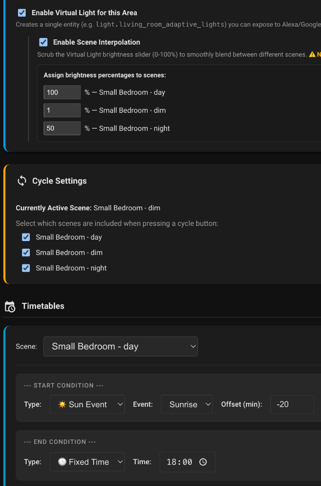

# Scene Manager for Home Assistant

Scene Manager is a custom Home Assistant integration that gives you powerful, UI-driven tools to manage your scenes dynamically based on time of day, sun events, and smart button interactions.

## Features

- **Adaptive Lighting Schedules:** Create timetables for any Area. Define when a specific scene should be active (e.g., Morning Scene at sunrise, Day Scene at 10:00 AM).
- **Smart Button Cycling:** Map your physical smart buttons (like Hue or IKEA remotes) to cycle forward or backward through your area's scenes with the `scene_manager.cycle_scene` service.
- **Automatic Virtual Switches:** The integration automatically generates a Virtual Switch for each area to easily turn on/off the adaptive lighting logic.
- **Virtual Lights with True Scene Interpolation:**
  - Expose a Virtual Light for your area to Alexa, Google Home, or Matter.
  - When a Virtual Light is turned on, it automatically calculates the current time and activates the appropriate scene from your schedule!
  - Automatically proxies voice commands to your adaptive scenes.
  - **Scene Interpolation:** Map scenes to specific brightness percentages (e.g., 20% = Night Scene, 100% = Day Scene). When you adjust the slider to 60%, the backend mathematically blends the RGB colors and brightness of your native Home Assistant scenes!

## Installation

### Via HACS (Recommended)
1. Open HACS in Home Assistant.
2. Click the three dots in the top right corner and select **Custom repositories**.
3. Add `https://github.com/danielalcalde/SceneManager` and select **Integration** as the category.
4. Click **Add**, then search for "Scene Manager" in HACS and click **Download**.
5. Restart Home Assistant.
6. The Scene Manager UI will automatically appear in your sidebar.

### Manual Installation
1. Download this repository.
2. Copy the `custom_components/scene_manager` folder to your Home Assistant `config/custom_components/` directory.
3. Restart Home Assistant.
4. The Scene Manager UI will automatically appear in your sidebar.

## Usage

### UI Dashboard
Open the "Scene Manager" panel in the sidebar to configure schedules, select which scenes to include in button cycling, and configure the Virtual Light interpolation map.

### Automation Services
- `scene_manager.turn_on_adaptive`: Calculates the correct scene for the current time and activates it.
- `scene_manager.cycle_scene`: Cycles to the next/previous scene in the rotation. Accepts a `direction` (`forward` or `backward`).

Both services support an optional `transition` parameter (in seconds) for smooth fading.
